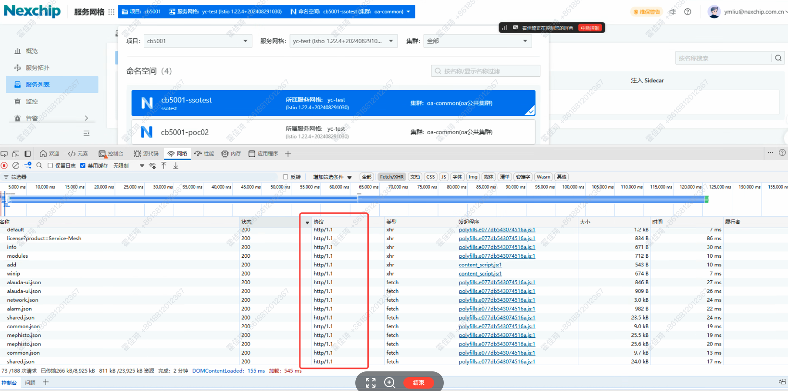

---
kind:
  - Troubleshooting
products:
  - Alauda Container Platform
  - Alauda DevOps
  - Alauda AI
  - Alauda Application Services
  - Alauda Service Mesh
  - Alauda Developer Portal
ProductsVersion:
  - 4.1.0,4.2.x
---
<!-- A type of document that involves encountering a fault, diagnosing it, performing root cause analysis, and providing solutions. -->

# 服务网格部分数据加载缓慢

部分数据加载缓慢 浏览器接口可能存在报错 存在143个请求堆积

## Cause
- Chrome浏览器对同域名存在5个并发限制
- F5负载均衡器未支持HTTP2协议

## Resolution
- 升级F5负载均衡器支持HTTP2协议

## [workaround]
- 在浏览器localstorage设置enabled_downgrade_watch=true缓解问题

## [Related Information]
**Screenshots**

- Environment: 3.18.1
- localstorage.enabled_downgrade_watch
- F5负载均衡器
- HTTP2协议
- Component: (待归类)
- Page ID: 333316657
- Original Title: 微服务-服务网格部分数据加载缓慢-115213
