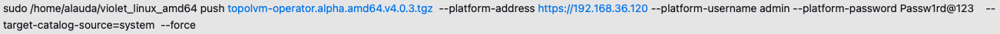
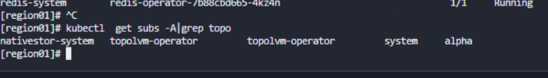
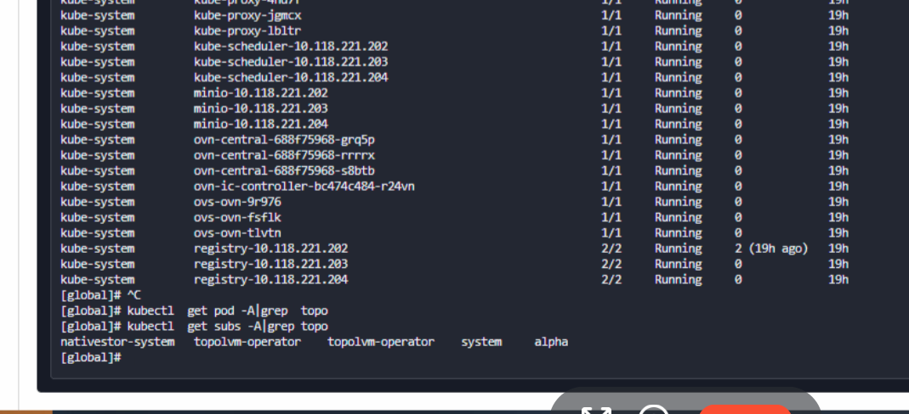
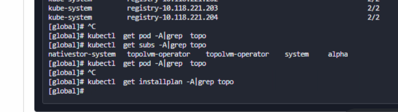
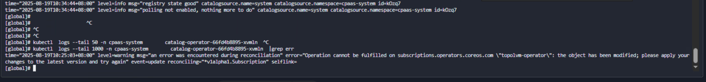
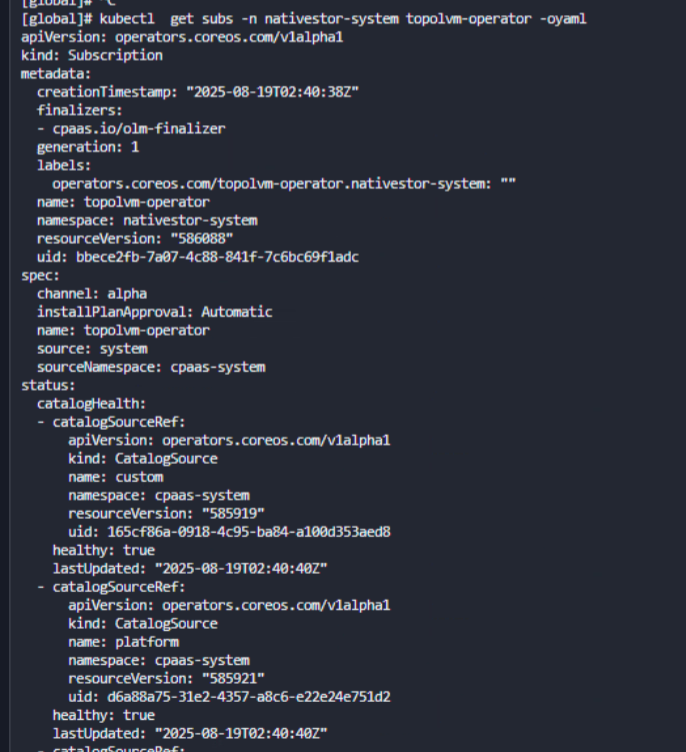
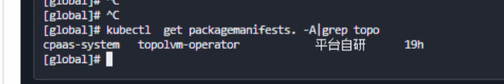
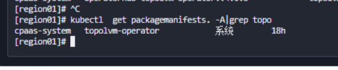

---
kind:
  - Troubleshooting
products:
  - Alauda Container Platform
  - Alauda DevOps
  - Alauda AI
  - Alauda Application Services
  - Alauda Service Mesh
  - Alauda Developer Portal
ProductsVersion:
  - 4.1.0,4.2.x
---
<!-- A type of document that involves encountering a fault, diagnosing it, performing root cause analysis, and providing solutions. -->

# topolvm创建异常

topolvm-operator 的pod未创建 topolvm的installplan资源未生成 subscriptions.operators.coreos.com 状态异常

## Cause
- packagemanifest 资源残留导致部署异常

## Resolution
- kubectl delete packagemanifest -n cpaas-system topolvm-operator
- 在global集群使用violet工具重新上架topolvm

## [workaround]

## [Related Information]
**Screenshots**

- Environment: 4.1.0
- topolvm-operator
- installplan
- catalog-operator
- subscriptions.operators.coreos.com
- packagemanifest
- Component: (待归类)
- Page ID: 333316733
- Original Title: 容器平台-存储-topolvm存储-topolvm创建异常-115504
