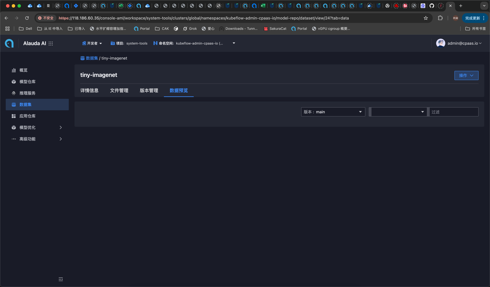
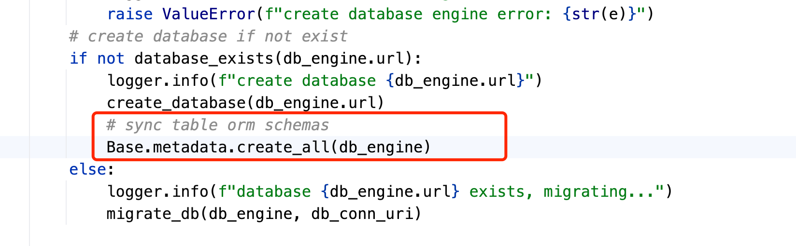
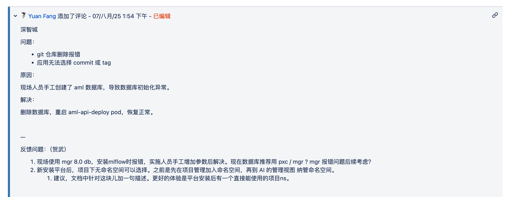

---
kind:
  - Troubleshooting
products:
  - Alauda Container Platform
  - Alauda DevOps
  - Alauda AI
  - Alauda Application Services
  - Alauda Service Mesh
  - Alauda Developer Portal
ProductsVersion:
  - 4.1.0,4.2.x
---
<!-- A type of document that involves encountering a fault, diagnosing it, performing root cause analysis, and providing solutions. -->

# 数据集数据预览无数据

数据集数据预览无数据 amlservice日志报错Table 'aml.datasets_meta' doesn't exist

## Cause
- 数据库存在但缺少表结构
- 代码逻辑在数据库存在时跳过表同步操作

## Resolution
- 手动删除aml数据库
- 触发缓存重建流程自动创建数据库和表结构

## [workaround]

## [Related Information]
**Screenshots**

- Environment: MySQL数据库环境
- aml数据库
- datasets_meta表
- psd组件
- sqlalchemy/pymysql
- 数据库存在性检查逻辑
- Component: (待归类)
- Page ID: 333742613
- Original Title: 数据集数据预览无数据
