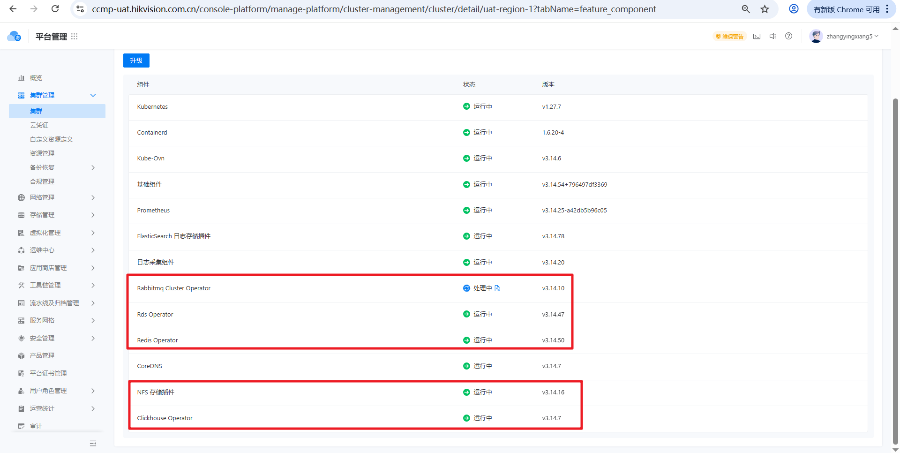

---
kind:
  - Troubleshooting
products:
  - Alauda Container Platform
  - Alauda DevOps
  - Alauda AI
  - Alauda Application Services
  - Alauda Service Mesh
  - Alauda Developer Portal
ProductsVersion:
  - 4.1.0,4.2.x
---
<!-- A type of document that involves encountering a fault, diagnosing it, performing root cause analysis, and providing solutions. -->

# 删除topolvm卡住

删除topolvm卡住很久

## Cause
- finalizers字段未被清除导致删除阻塞

## Resolution
- edit topolvmcluster资源，删除finalizers字段

## [workaround]

## [Related Information]
**Screenshots**

- Environment: 3.14.2
- topolvmcluster
- finalizers
- Component: (待归类)
- Page ID: 339443947
- Original Title: 容器平台-存储-topolvm存储-删除topolvm卡住-116008
