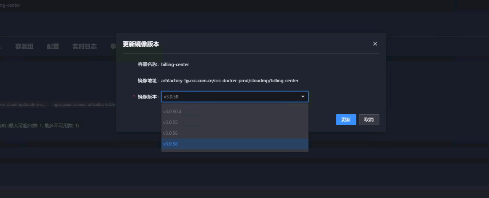

---
kind:
  - Troubleshooting
products:
  - Alauda Container Platform
  - Alauda DevOps
  - Alauda AI
  - Alauda Application Services
  - Alauda Service Mesh
  - Alauda Developer Portal
ProductsVersion:
  - 4.1.0,4.2.x
---
<!-- A type of document that involves encountering a fault, diagnosing it, performing root cause analysis, and providing solutions. -->

# 容器平台部署选择镜像无法选择镜像，显示灰色问题

部署选择镜像时显示灰色无法选择

## Cause
- 镜像架构版本与集群架构不一致（例如ARM集群使用非单ARM架构镜像）

## Resolution
- 升级到3.15及以上版本支持多架构镜像选择
- 使用与集群架构匹配的单架构镜像

## [workaround]

## [Related Information]
**Screenshots**

- Environment: 3.12.1
- 镜像架构
- 集群架构
- 平台版本
- Component: (待归类)
- Page ID: 345538848
- Original Title: Devops-容器平台部署选择镜像无法选择镜像，显示灰色问题
