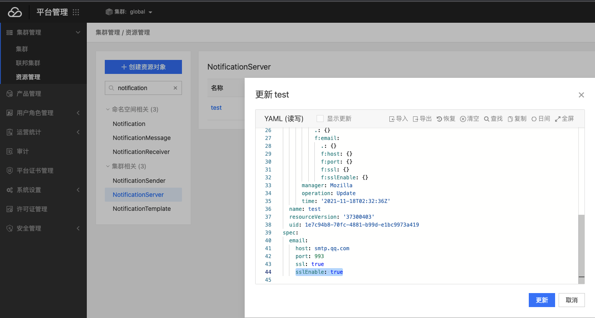

---
kind:
  - Troubleshooting
products:
  - Alauda Container Platform
  - Alauda DevOps
  - Alauda AI
  - Alauda Application Services
  - Alauda Service Mesh
  - Alauda Developer Portal
ProductsVersion:
  - 4.1.0,4.2.x
---
<!-- A type of document that involves encountering a fault, diagnosing it, performing root cause analysis, and providing solutions. -->

# 3.0.4通知服务器设置SSL方式后，无法正常添加邮件发送人

无法正常添加邮件发送人 报错500

## Cause
- 创建通知服务器时未正确配置SSL参数

## Resolution
- 在NotificationServer资源的.spec字段添加sslEnabled: true配置项

## [workaround]

## [Related Information]
**Screenshots**

- Environment: 3.0.4版本，邮件服务器使用465安全端口
- NotificationServer
- .spec.sslEnabled
- 465端口
- Component: (待归类)
- Page ID: 98878820
- Original Title: 3.0.4通知服务器设置SSL方式后，无法正常添加邮件发送人
