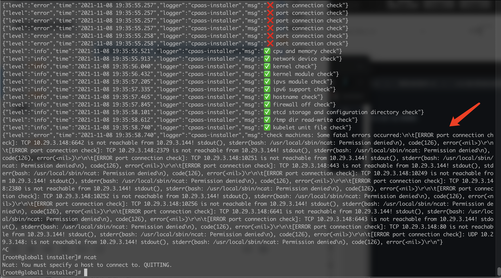

---
kind:
  - Troubleshooting
products:
  - Alauda Container Platform
  - Alauda DevOps
  - Alauda AI
  - Alauda Application Services
  - Alauda Service Mesh
  - Alauda Developer Portal
ProductsVersion:
  - 4.1.0,4.2.x
---
<!-- A type of document that involves encountering a fault, diagnosing it, performing root cause analysis, and providing solutions. -->

# 3.4.3

部署提示port connection check不通过 /usr/local/sbin/ncat: Permission denied

## Cause
- 3.4.3版本基线x86版本不支持麒麟操作系统
- ncat命令权限异常(600)

## Resolution
- 修改ncat权限为755: chmod 755 /usr/local/sbin/ncat

## [workaround]

## [Related Information]
**Screenshots**

- Environment: TKE 3.4.3 x86架构 + 麒麟v10操作系统
- /usr/local/sbin/ncat
- Component: (待归类)
- Page ID: 98878922
- Original Title: 3.4.3-部署-port connection check 不通过
