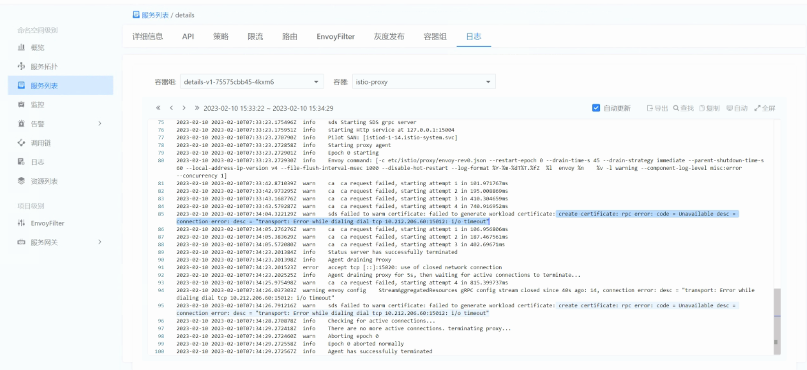

---
kind:
  - Troubleshooting
products:
  - Alauda Container Platform
  - Alauda DevOps
  - Alauda AI
  - Alauda Application Services
  - Alauda Service Mesh
  - Alauda Developer Portal
ProductsVersion:
  - 4.1.0,4.2.x
---
<!-- A type of document that involves encountering a fault, diagnosing it, performing root cause analysis, and providing solutions. -->

# 微服务无法启动,istio

微服务容器无法启动 istio-proxy报错dial tcp xxx:15012 i/o timeout 容器内无法连接svc地址及ep地址

## Cause
- istio组件和应用使用不同子网导致网络不互通

## Resolution
- 更新应用子网使其与istio组件处于相同子网

## [workaround]

## [Related Information]
**Screenshots**

- Environment: 3.10.1
- 15012端口
- istio-proxy
- svc地址
- ep地址
- 容器子网配置
- Component: Istio
- Page ID: 136536095
- Original Title: 微服务无法启动,istio-proxy报错dial tcp xxx:15012 i/o timeout
