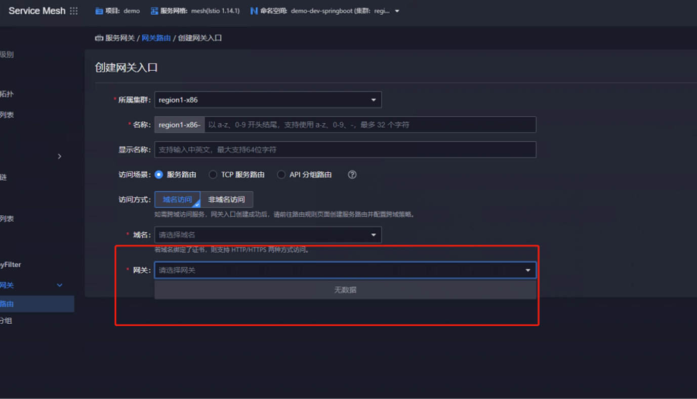
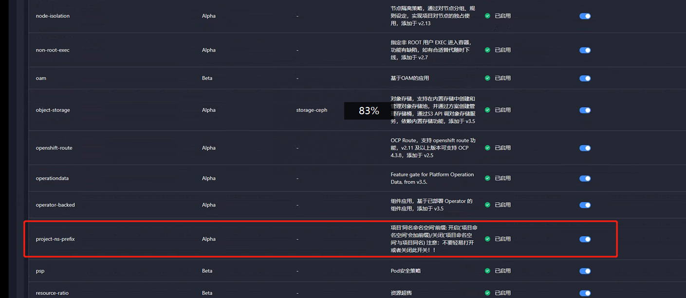

---
kind:
  - Troubleshooting
products:
  - Alauda Container Platform
  - Alauda DevOps
  - Alauda AI
  - Alauda Application Services
  - Alauda Service Mesh
  - Alauda Developer Portal
ProductsVersion:
  - 4.1.0,4.2.x
---
<!-- A type of document that involves encountering a fault, diagnosing it, performing root cause analysis, and providing solutions. -->

# 3.10.2

无法在网关路由中选择网关 新建的网关只能分配给cpaas和acp两个项目 其他项目(demo/test)分配失败

## Cause
- 项目下缺少与项目同名的命名空间(ns)
- 客户启用了alpha功能导致创建项目时生成带cpaas-prj-前缀的ns

## Resolution
- 手动创建与项目同名的命名空间(ns)

## [workaround]

## [Related Information]
**Screenshots**

- Environment: 3.10
- ns
- 项目名称
- cpaas-prj-前缀
- alpha功能
- Component: Istio
- Page ID: 140829074
- Original Title: 3.10.2-asm-itiso网关分配给项目后无法在网关路由中选择
