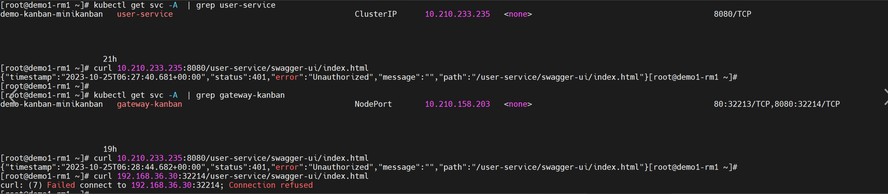
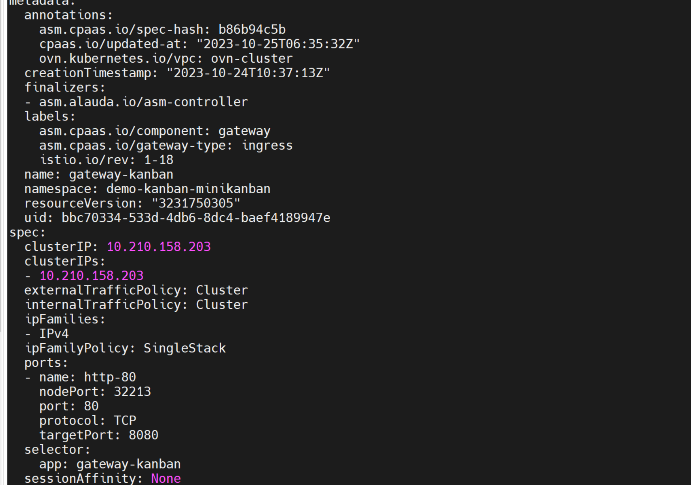
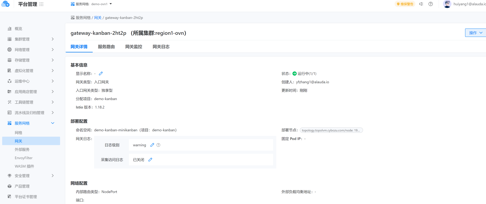

---
kind:
  - Troubleshooting
products:
  - Alauda Container Platform
  - Alauda DevOps
  - Alauda AI
  - Alauda Application Services
  - Alauda Service Mesh
  - Alauda Developer Portal
ProductsVersion:
  - 4.1.0,4.2.x
---
<!-- A type of document that involves encountering a fault, diagnosing it, performing root cause analysis, and providing solutions. -->

# 3.14

1、修改了NodePort Service externalTrafficPolicy 参数改成 Cluster，使用网关路由访问服务依旧失败，直接只用业务svc访问服务是通的。 查看了gateway的审计报错 "message": "Internal error occurred: failed calling webhook \"[validation.istio.io](http://validation.istio.io)\": failed to call webhook: Post 

## Cause

## Resolution
- 创建好服务路由后，使用asm网关路由访问服务，访问不通
- ## 解决方案
- 后续删除istiod-default-validator 这个[validatingwebhookconfigurations.admissionregistration.k8s.io](http://validatingwebhookconfigurations.admissionregistration.k8s.i

## [workaround]

## [Related Information]
**Screenshots**

- 14
- 2023
- 12
- 16
- istio
- 203
- 38
- //validatingwebhookconfigurations.admissionregistration.k8s.io
- 30
- 56
- Component: Istio
- Page ID: 179604351
- Original Title: 3.14-ASM-asm网关路由不通
