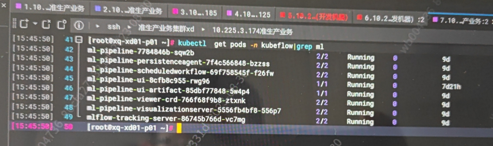
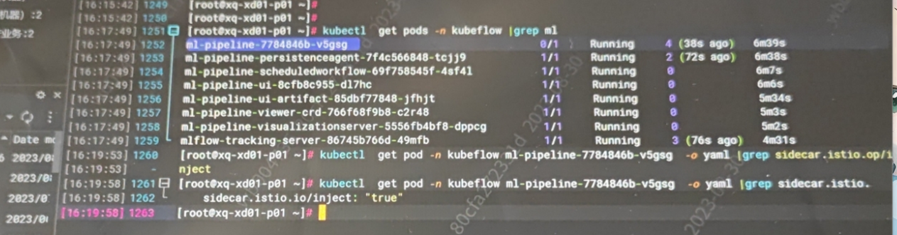
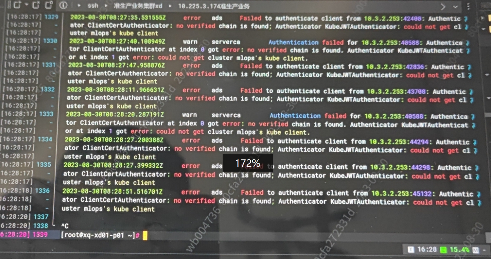
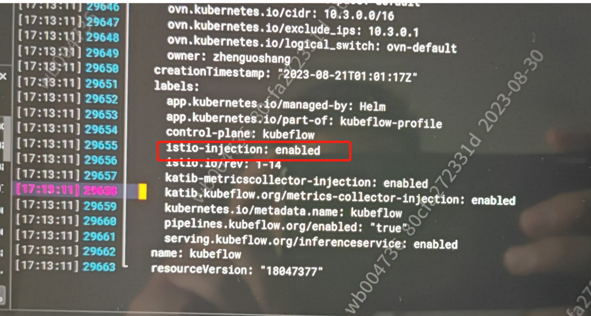

---
kind:
  - Troubleshooting
products:
  - Alauda Container Platform
  - Alauda DevOps
  - Alauda AI
  - Alauda Application Services
  - Alauda Service Mesh
  - Alauda Developer Portal
ProductsVersion:
  - 4.1.0,4.2.x
---
<!-- A type of document that involves encountering a fault, diagnosing it, performing root cause analysis, and providing solutions. -->

# 3.12.2

ml-pipeline 相关 Pod 处于 1/2 就绪状态 sidecar.istio.io/inject 注解状态异常 istiod 日志存在异常

## Cause
- kubeflow 命名空间存在 istio-injection label 导致 sidecar 注入被阻止

## Resolution
- 执行 kubectl get ns kubeflow -o yaml 检查并删除 istio-injection label

## [workaround]

## [Related Information]
**Screenshots**

- Environment: 3.12.2
- ml-pipeline Pod
- istiod
- sidecar.istio.io/inject
- kubeflow namespace
- Component: Istio
- Page ID: 179605078
- Original Title: 3.12.2-mlops-实验管理页面访问失败
