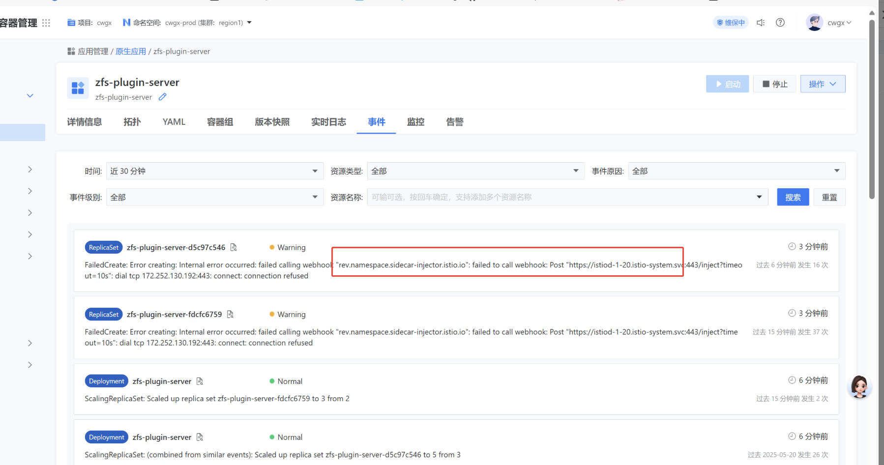
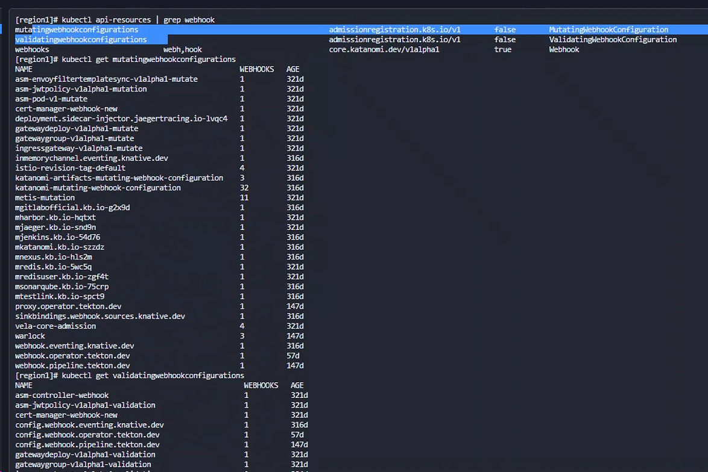

---
kind:
  - Troubleshooting
products:
  - Alauda Container Platform
  - Alauda DevOps
  - Alauda AI
  - Alauda Application Services
  - Alauda Service Mesh
  - Alauda Developer Portal
ProductsVersion:
  - 4.1.0,4.2.x
---
<!-- A type of document that involves encountering a fault, diagnosing it, performing root cause analysis, and providing solutions. -->

# 容器加副本，因为Istio报错无法加上去

无法增加容器副本并出现Istio相关webhook阻塞报错

## Cause
- 残留的Istio相关webhook资源阻塞副本扩展操作

## Resolution
- 备份并删除残留的webhook资源：kubectl delete mutatingwebhookconfigurations istio-sidecar-injector
- kubectl delete validatingwebhookconfigurations istio-validator-istio-system
- 备份yaml文件路径：region1集群master1节点~/目录

## [workaround]

## [Related Information]
**Screenshots**

- Environment: 3.16.1
- MutatingWebhookConfiguration
- ValidatingWebhookConfiguration
- istio-system
- region1集群
- Component: Istio
- Page ID: 327812175
- Original Title: 微服务-云原生应用-Istio相关-容器加副本，因为Istio报错无法加上去-113107
